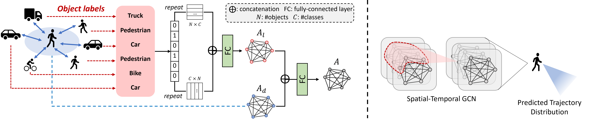

# Pytorch-based-Implementation-for-Label-aware-Graph-Convolution-Networks
Source code for "PyTorch-based implementation of label-aware graph representation for multi-class trajectory prediction".

  

## Training and validation
python train_2D3D.py --dataset 2D #2D: train for traffic trajectory; 3D: train for skeleton trajectory

